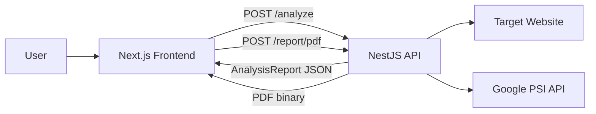

# AI Website Analyzer

Analyze any website for SEO, speed, security headers, and tech stack — with an actionable summary and downloadable PDF report.

<!-- Screenshot placeholder: add dashboard screenshot here -->

## Features

- **SEO analysis** — title, meta description, headings, Open Graph, image alt coverage
- **Speed metrics** — Google PageSpeed Insights performance score and Core Web Vitals
- **Security headers** — CSP, HSTS, X-Frame-Options, and related checks
- **Tech stack detection** — CMS, frameworks, CDN, and analytics via heuristics
- **Rule-based summary** — overall grade and prioritized recommendations
- **PDF export** — server-generated report via PDFKit

## Prerequisites

- **Node.js 18+**
- **Google PageSpeed Insights API key** — [Get a key](https://developers.google.com/speed/docs/insights/v5/get-started)

## Quick start

### Backend

```bash
cd backend
cp .env.example .env
# Edit .env and set GOOGLE_PSI_API_KEY
npm install
npm run start:dev
```

The API runs at `http://localhost:3001`.

### Frontend

```bash
cd frontend
cp .env.local.example .env.local
npm install
npm run dev
```

Open `http://localhost:3000`, enter a URL (e.g. `https://example.com`), and click **Analyze**.

## Environment variables

### Backend (`backend/.env`)

| Variable | Required | Default | Description |
|----------|----------|---------|-------------|
| `PORT` | No | `3001` | API server port |
| `CORS_ORIGIN` | No | `http://localhost:3000` | Allowed frontend origin |
| `GOOGLE_PSI_API_KEY` | Yes | — | Google PageSpeed Insights API key |
| `SUMMARY_PROVIDER` | No | `rule-based` | `rule-based` \| `openai` \| `anthropic` |
| `OPENAI_API_KEY` | Conditional | — | Required when `SUMMARY_PROVIDER=openai` |
| `ANTHROPIC_API_KEY` | Conditional | — | Required when `SUMMARY_PROVIDER=anthropic` |

### Frontend (`frontend/.env.local`)

| Variable | Required | Default | Description |
|----------|----------|---------|-------------|
| `NEXT_PUBLIC_API_URL` | No | `http://localhost:3001` | NestJS API base URL |

## Architecture

Minimal monorepo: Next.js frontend + NestJS backend. Stateless — no database.



```
User → Next.js → NestJS → [Target Site + PSI API]
                ↓
         AnalysisReport JSON → Dashboard
                ↓
         POST /report/pdf → PDF download
```

**Backend modules:** fetcher (HTTP + SSRF guard), analyzers (SEO, security, tech, speed), summary provider, report/PDF generation.

**Frontend:** single-page dashboard with URL form, result cards, and PDF download.

## Testing

From the `backend` directory:

```bash
# Unit tests
npm test

# End-to-end tests
npm run test:e2e
```

Frontend: manual smoke test — run both apps locally, analyze a URL, and download the PDF.

## Deployment (future)

Designed for deploy but shipped local-first:

| Service | Platform | Notes |
|---------|----------|-------|
| Frontend | [Vercel](https://vercel.com) | Set `NEXT_PUBLIC_API_URL` to production API URL |
| Backend | [Railway](https://railway.app) or [Render](https://render.com) | Set `CORS_ORIGIN` to Vercel URL |
| Secrets | Platform env vars | `GOOGLE_PSI_API_KEY`, optional LLM keys |

## Project structure

```
├── frontend/          # Next.js App Router dashboard
├── backend/           # NestJS API + analyzers + PDF
└── docs/              # Design spec and implementation plan
```

## License

MIT (portfolio / learning project)
